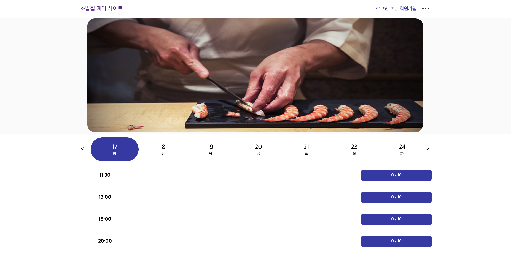

# 초밥집 예약 사이트

ReactJS를 사용한 예약 노쇼 방지를 위해 예약비를 받고 예약을 해주는 사이트
<br/>

<br/>
<br/>

## 배포되어 있는 사이트

<https://sushi-reservation-service.herokuapp.com>

## 시작

### 클론 프로젝트

```
git clone https://github.com/Joga-Bonito/sushi-reservation-service.git
```

### dependency 설치

```
npm install
cd client npm install
```

### 개발 모드 시작

```
yarn dev
```

## 주요 라이브러리

### client

- react, react-dom : 17.0.1
- react-query : 3.19.0
- axios : 0.21.1
- redux : 4.0.5
- react-redux : 7.2.2
- redux-thunk : 2.3.0
- redux-promise : 0.6.0
- styled-components : 5.2.1
  <br/>

### server

- node : 15.11.0
- npm: 7.6.0
- express : 4.17.1
- concurrently : 6.0.0
- nodemon : 2.0.7
- cors : 2.8.5
- jsonwebtoken : 8.5.1
- cookie-parser : 1.4.5
- mysql2 : 2.2.5
- sequelize : 6.6.5
- crypto-js : 4.1.1

## 폴더 구조 :

```
.
├── client
│     ├── src
│     │    ├── _actions
│     │    ├── _reducers
│     │    └── components
│     │            ├── admin
│     │            ├── layout
│     │            ├── reservations
│     │            └── user
│     └──Home.js
│
└── server
      ├── controllers
      ├── services
      ├── models
      ├── routes
      ├── server.js
      └── app.js
```

## 각각의 것들에 대한 개요

| 폴더 및 파일 | 설명                                                                                                      |
| ------------ | --------------------------------------------------------------------------------------------------------- |
| client       | 프론트엔드                                                                                                |
| \_actions    | 프로젝트에서 사용한 명령어(type)들과 API 통신과 같은 작업을 하는 action 메서드를 모아둔 폴더              |
| \_reducer    | reducer로 구성된 폴더이다. 리듀서는 action 메서드에서 변경한 상태를 받아 기존의 상태를 변경하는 일을 한다 |
| components   | React 컴포넌트로 구성된 폴더                                                                              |
| admin        | 관리자페이지 관련된 파일들로 구성된 폴더                                                                  |
| layout       | 레이아웃 관련된 파일들로 구성된 폴더                                                                      |
| reservation  | 예약 관련된 파일들로 구성된 폴더                                                                          |
| user         | 유저 관련된 파일들로 구성된 폴더                                                                          |
| server       | 백엔드                                                                                                    |
| controllers  | 들어오는 클라이언트 요청을 받고 service에 전달한다.                                                       |
| services     | controller로부터 받은 인자 기반 data를 가공해서 비즈니스 로직을 수행하고 결과를 클라이언트에 응답한다.    |
| models       | DB에 접근한다                                                                                             |
| routes       | 요청에 따른 라우터 분리 및 라우팅                                                                         |
| server.js    | express로 서버를 생성                                                                                     |
| app.js       | express 서버 middleware 적용                                                                              |

## 비지니스 룰

- 당일 예약X

- 이용 시간 : 1시간 30분

- 10개의 바 형식의 자리

- 하루 최대 예약 가능 인원 : 40명
